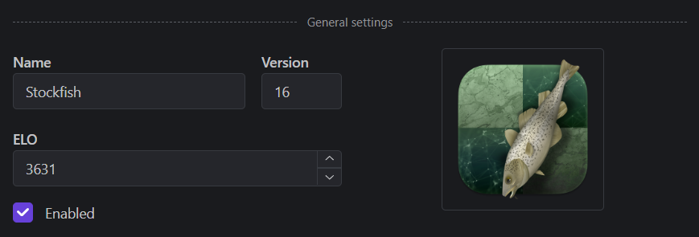
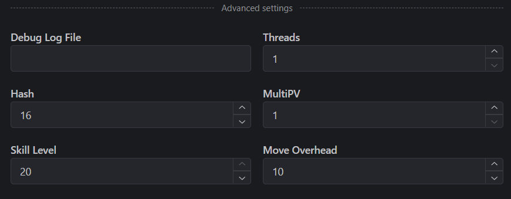

# Configure Engines

To configure an engine, go to the Engines page and select the engine you want to configure. Once you've selected the engine, you'll see the settings on the right side of the screen.

### General settings

General settings are the basic information about the engine.

- **Name and version**
- **ELO**: The estimated strength of the engine.
- **Enabled**: Whether the engine will be shown in the live analysis.
- **Image**: Click on the image to change it.

### Search settings

Search settings define how long the engine will think on each move. This corresponds to the `go` command in the UCI protocol.

- **Time**: search for the specified amount of time.
- **Depth**: search to the specified depth.
- **Nodes**: search the specified number of nodes.
- **Infinite**: search forever.

### Advanced settings

Advanced settings are the UCI options that the engine supports. These are specific to each engine and can be found in the engine's documentation.

Here's a list of some common options:

- **MultiPV**: The number of variations the engine will output. This is the equivalent for the "Number of lines" in the quick settings.
- **Threads**: The number of threads the engine will use.
- **Hash**: The size of the hash table. This is the amount of memory the engine will use to store the positions it has already analyzed.

::: warning
**Uci_ShowWDL** is not supported. Enabling it will break the live analysis and game reports.

**Uci_Chess960** is automatically enabled in games with the header `Variant "Chess960"`, so you shouldn't enable it in the engine settings. It will break the live analysis and game reports in standard chess games.
:::